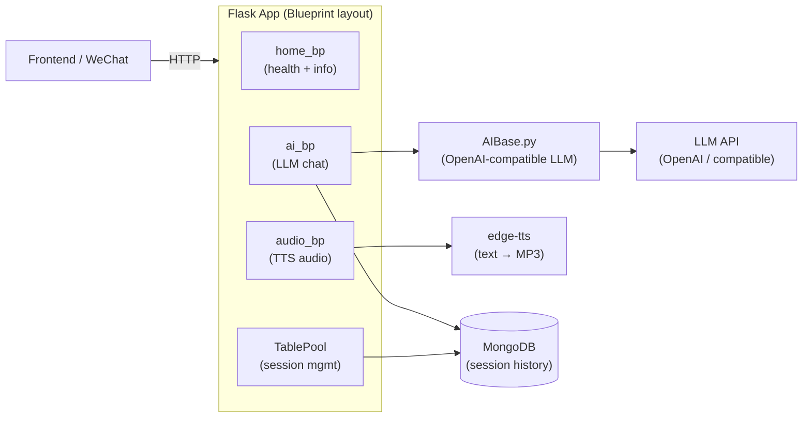

# Realistic-Consultation · AI Consultation Platform (Full-Stack Monorepo)

> **Full-stack monorepo: Flask backend (LLM + TTS + MongoDB) + Vue 3 frontend (chat UI).**

**Monorepo layout:** `./` = Python Flask backend · `frontend/` = Vue 3 chat UI

---

# Realistic-Consultation-Back-End · AI Consultation Flask Backend

> **A Flask backend powering a realistic AI consultation experience — LLM conversation history, edge-TTS voice synthesis, and MongoDB session storage.**
>
> Flask 驱动的 AI 拟真咨询后端：LLM 对话历史管理、edge-TTS 语音合成、MongoDB 会话存储，蓝图模块化架构。

[English](#english) · [中文](#中文)


---

<a id="english"></a>

## Architecture



## Quickstart

```bash
pip install -r requirements.txt
cp .env.example .env  # fill OPENAI_API_KEY, MONGODB_URI
python run.py
```

### Key env vars

```env
OPENAI_API_KEY=sk-...
OPENAI_BASE_URL=https://api.openai.com/v1
MONGODB_URI=mongodb://localhost:27017/consultation
```

## API Overview

| Blueprint | Path | Description |
|---|---|---|
| `ai_bp` | `/api/content` | Get formatted conversation history |
| `ai_bp` | `/api/chat` | Send message, get LLM reply |
| `audio_bp` | `/api/audio` | TTS: text → audio response |
| `table_bp` | `/api/session/**` | Session CRUD |

## Technical Highlights

<details>
<summary><b>LLM + TTS pipeline — text response becomes voice</b></summary>

- **S**: An AI consultation that only returns text misses the "realistic" dimension — patients need to hear responses, not read them.
- **A**: `ai_bp` calls `AIBase.py` (OpenAI-compatible) to get the LLM reply text, then `audio_bp` feeds that text to `edge-tts` which synthesizes an MP3 on the fly. The audio URL is returned alongside the text in the same response.
- **R**: Single API round-trip delivers both text and audio; no separate TTS request from the client.
</details>

<details>
<summary><b>MongoDB session history with formatted context injection</b></summary>

- **S**: LLM APIs are stateless; maintaining coherent multi-turn consultation requires injecting full conversation history every request.
- **A**: `MongoBase.py` stores each turn as a document. `GET /api/content` retrieves and formats the session history as an OpenAI `messages[]` array, which `AIBase.py` prepends to every new LLM call. `TablePool` manages session lifecycle (create, expire, clear).
- **R**: Coherent multi-turn conversation with persistent history that survives server restarts.
</details>

## Repo Layout

```
application/
├── ai.py          ai_bp — chat endpoint + LLM call
├── AIBase.py      OpenAI-compatible LLM wrapper
├── audio.py       audio_bp — TTS synthesis
├── MongoBase.py   MongoDB connection + document CRUD
├── routes.py      Blueprint assembly
├── TablePool.py   session management
├── config.py      env-based config
└── utils.py       shared helpers
run.py             Flask entry point
```

## Roadmap

- [x] LLM multi-turn conversation with MongoDB history
- [x] edge-TTS voice synthesis endpoint
- [x] Blueprint modular architecture
- [ ] Streaming LLM response (SSE)
- [ ] Emotion detection for adaptive consultation style
- [ ] WebSocket real-time voice input (ASR)

---

<a id="中文"></a>

## 中文速读

- **是什么**：拟真 AI 咨询后端，Flask 蓝图架构，LLM 多轮对话 + MongoDB 会话历史 + edge-TTS 语音合成，单次 API 返回文本与音频。
- **亮点**：`MongoBase.py` 持久化对话历史，每次请求注入完整上下文保证连贯性；LLM → TTS 管道无需客户端二次请求。
- **运行**：`pip install -r requirements.txt && python run.py`。

## License

MIT © [Seal-Re](https://github.com/Seal-Re)
